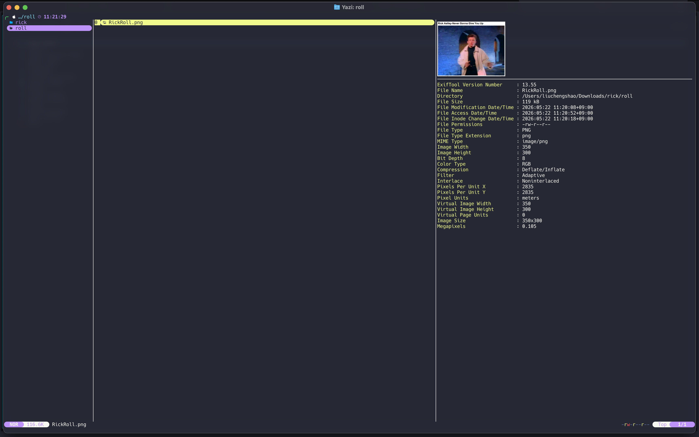

[English](README.md) | [繁體中文](README.zh-TW.md) | [한국어](README.ko.md)

# exif-image.yazi

A [Yazi](https://github.com/sxyazi/yazi) plugin that provides a dual-pane preview for images, combining high-quality native image rendering with an image metadata list.



## Requirements & Dependencies

- [`exiftool`](https://github.com/exiftool/exiftool): Required to extract image metadata.

### macOS

Can be installed via Homebrew:

```bash
brew install exiftool
```

## Installation

### Using [`ya pkg` package manager](https://yazi-rs.github.io/docs/cli/#pm) (Recommended)

```bash
ya pkg add yozlog/exif-image
```

### Manual Installation

Clone using `git`:

```bash
git clone https://github.com/yozlog/exif-image.yazi.git ~/.config/yazi/plugins/exif-image.yazi
```

## Configuration

Add the previewer to your `yazi.toml`:

```toml
[plugin]
prepend_previewers = [
  { mime = "image/*", run = "exif-image" }
]
```

## Keybindings

Configure keybindings in your `keymap.toml`:

```toml
[[mgr.prepend_keymap]]
on   = [ "<C-j>" ]
run  = "plugin exif-image 1"
desc = "Metadata next page"

[[mgr.prepend_keymap]]
on   = [ "<C-k>" ]
run  = "plugin exif-image -1"
desc = "Metadata prev page"
```

## Usage

When hovering over an image file, the preview pane will automatically split to show the image on top and the metadata below. Use the configured `Ctrl-j` and `Ctrl-k` keys to scroll through the metadata pages.
